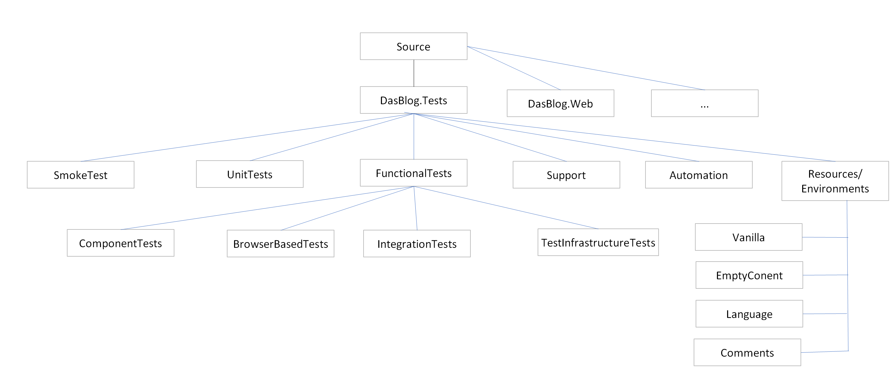

#### Functional Tests

##### Usage
to run dasblog-core functional tests locally:

change directory to the project directory (containing .git) usually called dasblog-core and do
```
dotnet test source/DasBlog.Tests/FunctionalTests --logger trx;LogfileName=test_results.xml --results-directory ./test_results --filter Category!=TestInfrastructureTest
``` 

to run on AppVeyor configure the test script:
```
set EMAIL=mikemay@blahblah.com
dotnet test source/DasBlog.Tests/FunctionalTests --filter Category!=TestInfrastructureTest
```
Obviously substitute whatever email address suits - I have not worked out what the function of git's 
user.email (which the EMAIL env var refers to) is yet. 
You can set the env var in the Environment section on AppVeyor, if you prefer.

For failing tests the logs will be printed along with the results.  On local runs if you need to inspect the logs for passing tests
the the location  is `source/DasBlog.Tests/FunctioalTests/test_results/test_results.xml`.

Note that DasBlog.Tests/FunctionalTests/appsettings.json contains some log settings but may be overriden by the appsettings.json file in the subdirectories for
the various types of test, ComponentTests or BrowserBasedTests.  There is currently no logging for the
IntegrationTests.

##### Introduction
There are 4 kinds of functional test.  These are distinct from unit tests which are not discussed.  Functional tests
exercise coarse grained features of the application with minimal mocking.  XUnit is used as the framework in all cases.

Functional tests can be run using the dotnet test runner or the VS or Rider test runners.  See Usage above.

All tests are run serially.  They suppress XUnit's default parallelism.

###### Context
The following diagram shows how the functional tests are positioned within the overall solution hierarchy.  In 
addition to the artifacts briefly discussed in the paragraphs that follow the diagram you will see there
are projects for Support and Automation which provide helper classes and routines to the test projects.  There
is also the Environments hierarchy which is a versioned file system in which the user can select which sand boxed
environment to use in each test.



###### Component Tests
Component tests exercise specific services or data repositories such as the BlogManager. They are entirely synchronous
and do not use the browser.

See [Component Tests](ComponentTests/ComponentTests.md)

###### Browser Based Tests
Browser based tests use Selenium to drive the browser and run the dasblog-core web app as a server albeit on
purpose built test data.  These are the coarsest grained tests.

See [Browser Based Tests](BrowserBasedTests/BrowserBasedTests.md)

###### Integration Tests
Integration tests (so called because the author ran out of names) use the ASP.net core testing framework which creates
an http client and an http server (using the dasblog-core web app code running in the test runner's process).  They
might be useful where the main test verification is inspection of HTML markup or HTTP return codes.

Integration tests, unlike Component and Browser Based, currently employ no dasblog-core specific framework or platform.
Tests interact directly with `Microsoft.AspNetCore.Mvc.Testing` see [Integration tests in ASP.NET Core](https://docs.microsoft.com/en-gb/aspnet/core/test/integration-tests?view=aspnetcore-2.1).
There is no reason why the sand box system used by the Component Tests cannot be employed with
integration tests.

###### Test Infrastructure Tests
Yes.  The test framework is sufficiently complex that tests of the framework itself are necessary.  These are not
intended to be run as part of continuous integration.  They are most useful when developing new parts of the framework
allowing the user to exercise features as part of development.


###### Comparisons
A browser based test is the most comprehensive allowing a full end-to-end test of a feature.  However they are also the
least robust.  Component tests are quicker to write and more robust.  Integration tests sit somewhere in the middle.
Time and experience (and perhaps personal taste) will determine which sort of test addresses which sort of testing
problem.

In comparison to unit tests, functional tests take a long time to run, need a greater learning investment and are less
robust.  It is the author's contention that they are essential in a project where the absence of much business logic
means that there is a reduced pay off from unit testing.

##### See Also
- [Functional Test Infrastructure](FunctionalTestDataInfrastructure.md)