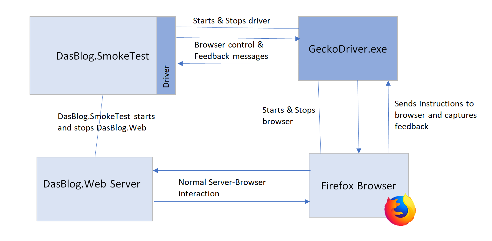

### Selenium Plus DasBlog-core in a Couple of Pages
* You need Firefox installed to use Selenium here

##### Use Cases
1. Smoke Test (see [readme.md](DasBlog.SmokeTest/readme.md) at DasBlog.SmokeTest)
2. Functional Tests (not yet implemented)

##### Configuration
Install Firefox - I imagine any recent version will do

Chrome, Edge, Safari and Opera are not supported here yet

Nothing is required from the Selenium site - I have had no requirement for the Selenium IDE
or the Selenium Server but of course no reason why not to grab the IDE.

No actual configuration is required.  DasBlog.SmokeTest and DasBlog.FunctionalTests are fully
set up to use Selenium.  Famous last words, so when you do find yourself
knocking up an installation (for a simple test case or whatever) have a look at
DasBlog.FuncionalTests.csproj which describes our slightly unconventional approach
to configuration

##### Resources
https://github.com/FeodorFitsner/selenium-tests

https://www.seleniumhq.org/

##### Rationale
Justification for functional tests is covered in [DasBlog Core, Issue 124, Measuring Test Coverage](https://github.com/poppastring/dasblog-core/issues/124)

As for the selected tool, Selenium seems to be the market leader at our desired price point.
If you've evaluated it in the past and thought it was too much trouble then the good news is it is 
much improved.  Simple to configure and use.

##### Selenium Architecture
Selenium has C# bindings in the form of an assembly running within the DasBlog test process,
beit DasBlog.SmokeTest or DasBlog.FunctionalTests.  Our tests call an API on the
FirefoxDriver object exposed
by this assembly and the FirefoxDriver assembly uses a wire protocol that we con't care about to communicate
with an external process (iteself called a driver, causing a certain amount of confusion).
In the case of Firefox, this is geckodriver.exe.  This driver controls the browser instance
targeted by our tests.  It starts and stops the browser and makes the automated manipulation happen
clicking buttons, returning text etc.

The only addition DasBlog-core makes to this is to add _running the web server_ as
part of the start up process.  This was not an essential design decision, the tests could
have easily operated against a permanently running version.  This approach was adopted for convenience.

#### Schematic of Relationships Between Components (Firefox Example)

#### DasBlog Automation Components
We introduce a few concepts / class hierarchies to support automation.  These are inspired by the
automation framework in the Pluralsight course  [Automated Web Testing with Selenium and WebDriver Using Java by Bryan Hansen](https://app.pluralsight.com/library/courses/automated-web-testing-selenium-webdriver-java/table-of-contents)

* A **Browser** object abstracts the driver mechanisms and provides a simplified API to the other components.
* A set of **Page** objects encapsulate the properties and behaviour of the dasblog web pages.  These
components are unaware of the automation mechanism.
* Tests call into the pages to manipulate and retrieve information
* There is a set of **PageElement** objects which link the dasblog components to the Selenium web components.  It would
be possible to write these with or convert them to an approach independent of the automation mechanism
but this doesn't currently seem necessary.

#### Design Choices
* A key goal has been to enable contributors to create functional tests for the features they introduce
without the need for a deep understanding of Selenium.
* To that end the decision was made to identify all page elements by their id.  (Selenium has
miriad ways to identify elements which would entail a richer association with Selenium.)
  This is slgithly intrusive necessitating giving components
ids purely for testing purposes.

#### Pattens of Delvelopent
1. The user will add a test to the existing functional or smoke tests.
2. This will use existing functionlity on the dasblog **Page** objects to carry out the test.
3. New dasblog **PageElement**s will have to be added to the **Page** objects to reflect new elements added by the
feature under test
4. More infrequently, it may be necessary to add functionality to the **Browser** where new behaviour has been introduced.

